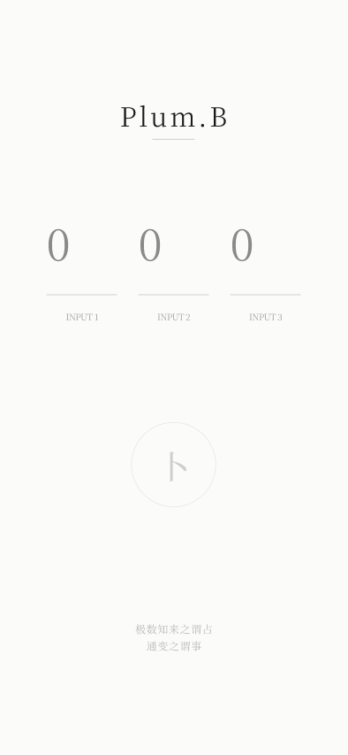
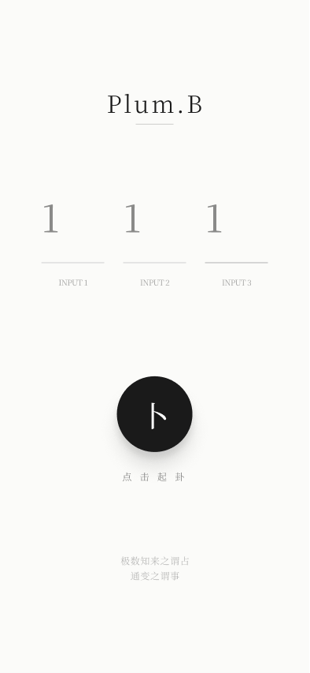
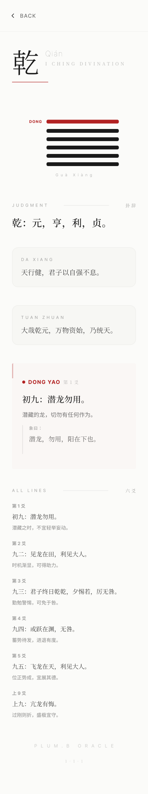

# Plum.B

  A minimalist I Ching divination app built with SwiftUI.

  极数知来之谓占，通变之谓事。

  "To know what is coming through numbers is divination; to understand change is the work of life."

## Overview

`Plum.B` is a minimalist SwiftUI app inspired by the visual tone of classical East Asian typography and the symbolic structure of the I Ching.

Users enter three numbers to cast a hexagram, then view a refined result page with the generated gua, judgment text, image commentary, moving line, and the full six-line reading.

## Screens

  
  
  

  Input
  &nbsp;&nbsp;&nbsp;&nbsp;&nbsp;&nbsp;&nbsp;&nbsp;
  Ready
  &nbsp;&nbsp;&nbsp;&nbsp;&nbsp;&nbsp;&nbsp;&nbsp;
  Result

## Features

- Minimal input and result flows built with SwiftUI
- Hexagram generation based on three numeric inputs
- Structured result presentation for judgment, da xiang, tuan zhuan, moving line, and all six lines
- Typography-first interface with a restrained editorial layout

## Tech Stack

- Swift
- SwiftUI
- Xcode

## Run Locally

1. Open `Plum.B.xcodeproj` in Xcode
2. Select an iPhone simulator or a physical device
3. Build and run `Plum.B`

---

## 中文说明

`Plum.B` 是一个以《易经》起卦体验为主题的 SwiftUI 应用，整体视觉强调留白、节奏感，以及中英文字体混排的东方气质。

用户输入 3 个数字后即可起卦，随后进入结果页查看卦象、卦辞、大象、彖传、动爻，以及完整六爻内容。

### 功能

- 使用 SwiftUI 构建极简输入页与结果页
- 基于 3 个数字输入生成卦象结果
- 展示卦辞、大象、彖传、动爻与六爻信息
- 通过字体、间距和层级控制统一整体阅读体验

### 本地运行

1. 使用 Xcode 打开 `Plum.B.xcodeproj`
2. 选择 iPhone 模拟器或真机
3. 运行 `Plum.B`
